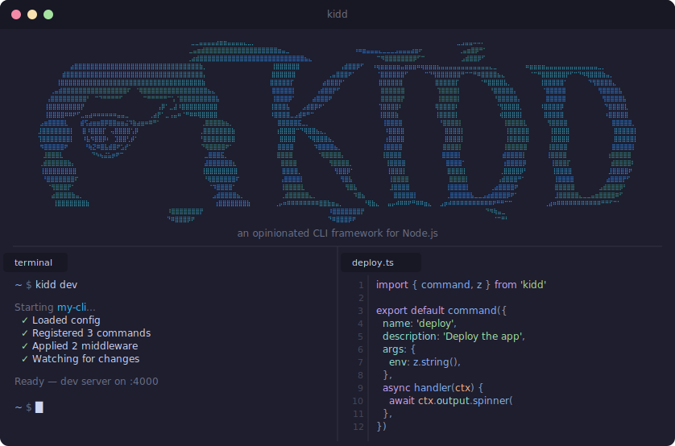

<div align="center">
  
  <p><strong>An opinionated CLI framework for Node.js. Convention over configuration, end-to-end type safety.</strong></p>
  <a href="https://kidd.dev">Documentation</a>
</div>

## Features

- 🧰 **Batteries included** — Config, auth, prompts, logging, output, and middleware built in
- 📁 **File-system autoloading** — Drop a file in `commands/`, get a command
- ⚡ **Build and compile** — Bundle your command tree or produce cross-platform standalone binaries
- 🚀 **Two files to a full CLI** — Define a schema, write a handler, done
- 🛠️ **Developer experience** — Scaffolding, hot reload, route inspection, and diagnostics out of the box

## Install

```bash
npm install @kidd-cli/core
```

## Usage

### Define your CLI

```typescript
// index.ts
import { cli } from '@kidd-cli/core'
import { z } from 'zod'

await cli({
  name: 'deploy',
  version: '0.1.0',
  config: {
    schema: z.object({
      registry: z.string().url(),
      region: z.enum(['us-east-1', 'eu-west-1']),
    }),
  },
})
```

### Add a command

```typescript
// commands/deploy.ts
import { command } from '@kidd-cli/core'
import { z } from 'zod'

export default command({
  description: 'Deploy to the configured registry',
  args: z.object({
    tag: z.string().describe('Image tag to deploy'),
    dry: z.boolean().default(false).describe('Dry run'),
  }),
  handler: async (ctx) => {
    ctx.logger.info(`Deploying ${ctx.args.tag} to ${ctx.config.region}`)
  },
})
```

### Run it

```bash
kidd dev -- deploy --tag v1.2.3         # dev mode
kidd build                              # bundle
kidd compile                            # standalone binary
```

## License

[MIT](LICENSE)
