# kidd

An opinionated CLI framework for Node.js. Convention over configuration, end-to-end type safety.

## Architecture

```mermaid
%%{init: {
  'theme': 'base',
  'themeVariables': {
    'primaryColor': '#313244',
    'primaryTextColor': '#cdd6f4',
    'primaryBorderColor': '#6c7086',
    'lineColor': '#89b4fa',
    'secondaryColor': '#45475a',
    'tertiaryColor': '#1e1e2e',
    'background': '#1e1e2e',
    'mainBkg': '#313244',
    'clusterBkg': '#1e1e2e',
    'clusterBorder': '#45475a'
  },
  'flowchart': { 'curve': 'basis', 'padding': 15 }
}}%%
flowchart LR
    subgraph framework["Framework"]
        K(["kidd"])
        CLI(["@kidd/cli"])
    end

    subgraph internal["Internal"]
        CFG(["@kidd/config"])
        UTL(["@kidd/utils"])
        BDL(["@kidd/bundler"])
    end

    CLI --> K
    CLI --> BDL
    K --> CFG
    K --> UTL
    BDL --> CFG

    classDef core fill:#313244,stroke:#89b4fa,stroke-width:2px,color:#cdd6f4
    classDef int fill:#313244,stroke:#6c7086,stroke-width:1px,color:#a6adc8

    class K,CLI core
    class CFG,UTL,BDL int

    style framework fill:#181825,stroke:#89b4fa,stroke-width:2px
    style internal fill:#181825,stroke:#6c7086,stroke-width:1px
```

## Packages

| Package                                  | Purpose                                                  | Runtime  |
| ---------------------------------------- | -------------------------------------------------------- | -------- |
| [`kidd`](./reference/kidd.md)            | Core CLI framework (commands, middleware, config, store)  | CLI      |
| [`@kidd/cli`](./reference/cli.md)        | DX companion CLI (init, build, doctor, add)               | CLI      |
| `@kidd/config`                           | Configuration loading, validation, and schema (internal)  | Library  |
| `@kidd/utils`                            | Shared functional utilities (internal)                    | Library  |
| `@kidd/bundler`                          | tsdown bundling and binary compilation (internal)         | CLI      |

## Concepts

- [Lifecycle](./concepts/lifecycle.md) -- invocation phases, middleware onion model, error propagation
- [Context](./concepts/context.md) -- the central API surface threaded through handlers and middleware
- [Configuration](./concepts/configuration.md) -- config file formats, discovery, validation, and the config client
- [Authentication](./concepts/authentication.md) -- credential resolution, login flow, token storage, HTTP integration

## Guides

- [Build a CLI](./guides/build-a-cli.md) -- commands, middleware, config, and sub-exports
- [Add Authentication](./guides/add-authentication.md) -- auth middleware, login commands, HTTP client

## Reference

- [kidd](./reference/kidd.md) -- core framework API
- [@kidd/cli](./reference/cli.md) -- DX companion CLI commands
